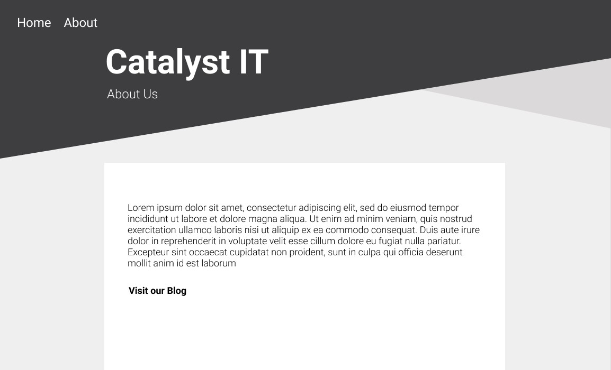
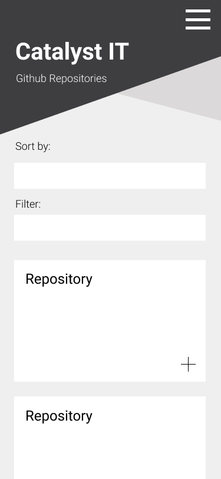
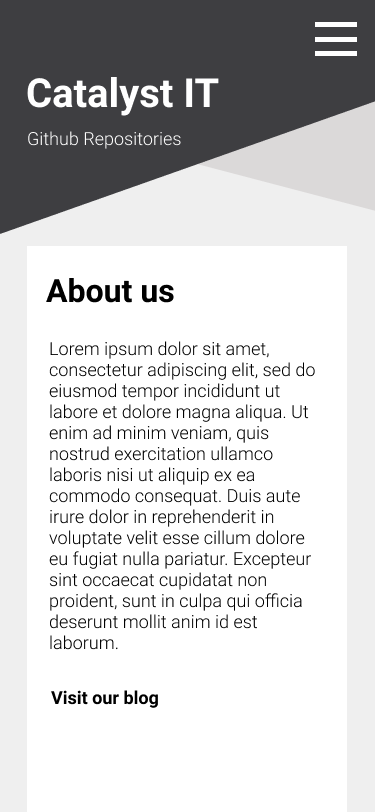

## Catalyst IT - Github Repositories
---
A web application database of Catalyst IT github repositories


## To run the app on your local machine

1. Clone the repository

2. In command line:   

``` 
    npm install / yarn install 

    npm start / yarn start   
    
``` 

## Design Mockups

Home - Desktop


About - Desktop



Mobile

 | 